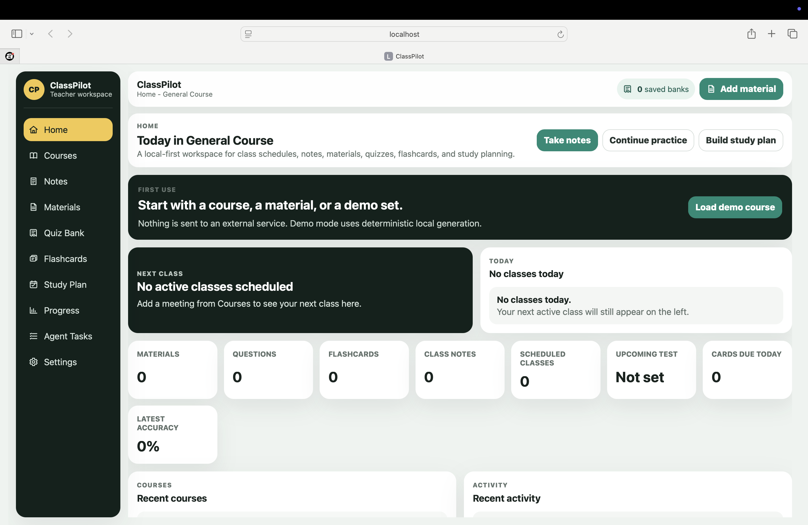
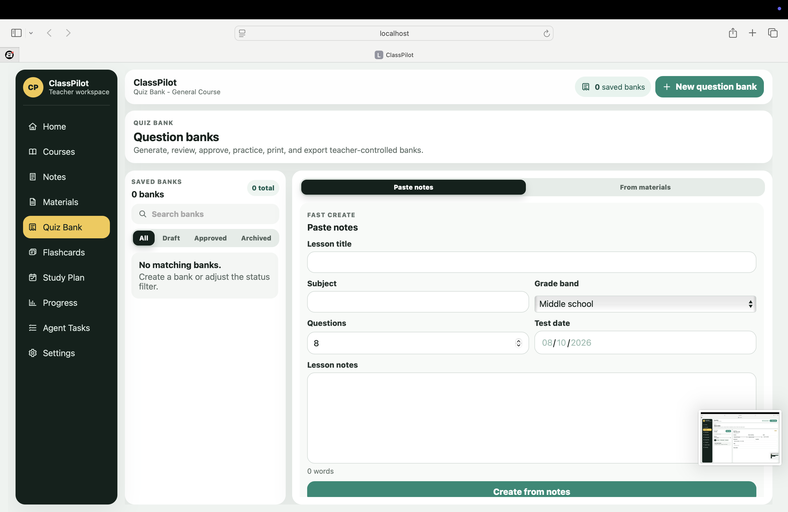
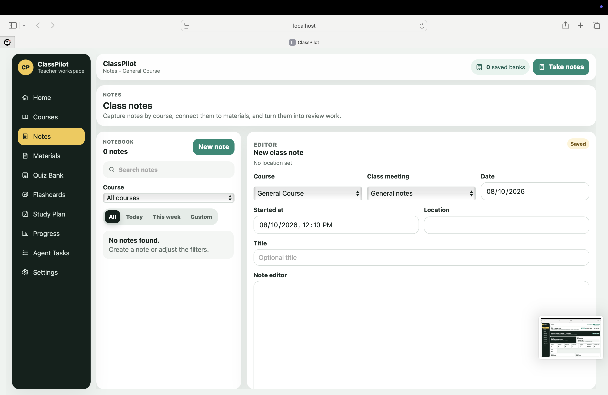
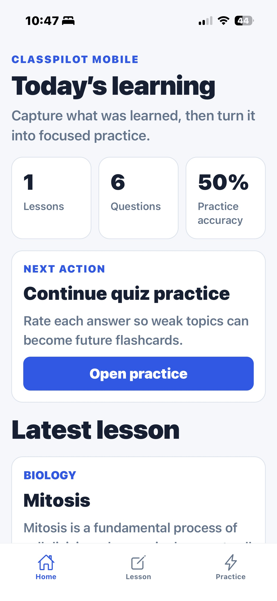
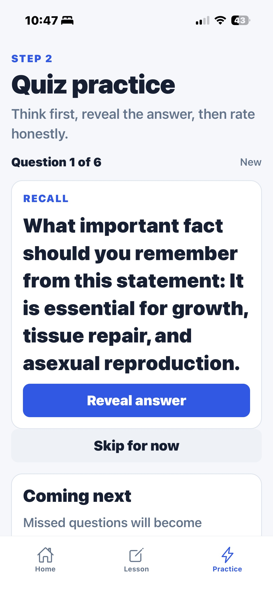

# ClassPilot

**Student Study & Academic Planner for Web + Mobile**

ClassPilot is a local-first student productivity system for organizing courses, schedules, notes, materials, quizzes, flashcards, assignments, exams, study plans, and progress in one connected workflow.

Built and published by **Robinson Software Works**.

## Product Showcase

### Web Dashboard

### Quiz Bank

### Notes Workspace

### Mobile App

| Today's Learning | Quiz Practice |
| --- | --- |
|  |  |

## Web + Mobile

The complete ClassPilot package includes both a React/Vite web application and an Expo/React Native mobile application.

### Key Features

- Course and class schedule organization
- Notes and learning-material management
- Quiz banks and practice questions
- Flashcards and review workflows
- Assignments and exam tracking
- Study planning
- Progress and practice tracking
- Local-first data storage
- Web and mobile source code
- Setup documentation

## Local-First

ClassPilot V1 does not require a backend, authentication service, or monthly backend subscription to get started.

Web and mobile data are stored locally and independently in V1. Automatic Web ↔ Mobile cloud synchronization is not included.

## Technology

**Web:** React, Vite, JavaScript, CSS  
**Mobile:** React Native, Expo, Expo Router, TypeScript

## Complete Source Code

The commercial ClassPilot package includes the complete Web + Mobile source code and setup documentation.

**$69.99 USD — one-time purchase**

[**Purchase ClassPilot from Robinson Software Works →**](https://robinsonsoftwareworks.lemonsqueezy.com/checkout/buy/90f3d7c8-7b05-433b-b52a-e637ccbf521b)

## Commercial Source Notice

This public repository is a **product showcase only**. It does not contain the commercial ClassPilot source code.

The complete source package is distributed to licensed customers through Robinson Software Works. Redistribution, resale, sublicensing, or publication of the commercial source as another source-code/template product is not permitted.

## Publisher

**Robinson Software Works**  
ClassPilot V1.0.0
